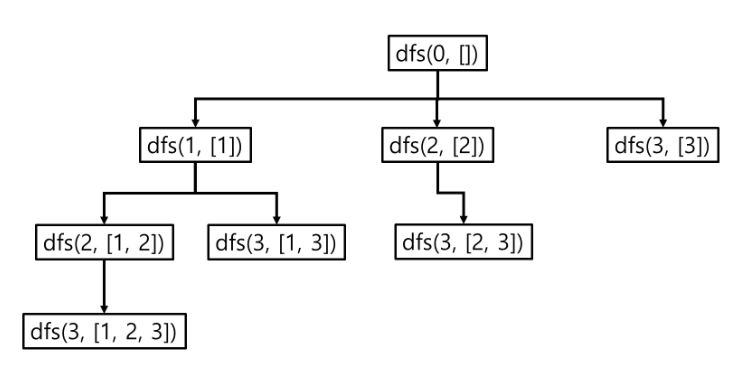
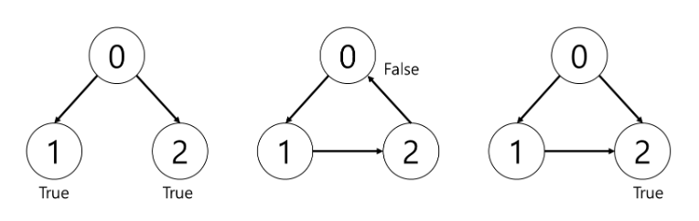

# 0907| 파알인 12.그래프 | 문제풀이모음


# 📚 커리큘럼

- 주제 : <파이썬 알고리즘 인터뷰> 12장. 그래프


## 🔸 재승 joney0715


## 🔠 문제37. 부분 집합

- 문제 링크 : https://leetcode.com/problems/subsets/

### ⌛ 문제

모든 부분 집합을 리턴

### 🔑 풀이1 (교재풀이)

```python
nums = [1,2,3]

subsets = []

def dfs(n, subset):
    subsets.append(subset)

    for i in range(n, len(nums)):
        dfs(i+1, subset+[nums[i]])

dfs(0, [])

print(subsets)
```

### 설명

- DFS를 사용해서 인덱스를 하나씩 증가시키면서 부분 집합에 추가



- 비트 연산자가 아닌 DFS를 사용한 문제 풀이
- 비트 연산자보다 직관적이기 때문에 부분집합을 구하거나 리스트의 조합, 순열 등을 구할 때 용이


## 🔠 문제39. 코스 스케줄

- 문제 링크 : https://leetcode.com/problems/course-schedule/

### ⌛ 문제

0을 완료하기 위해서는 1을 끝내야 한다는 것을 [0,1] 쌍으로 표현하는 n개의 코스가 있다. 코스 개수 n과 이 쌍들을 입력으로 받았을 때 모든 코스가 완료 가능한지 판별하라.

### 🔑 풀이1 (교재풀이)

```python
import collections

def dfs(i):
    # 이미 방문한 노드가 나오면 순환 구조이기 때문에 False
    # 예를 들어 [[0,1], [1,2], [2,0]]
    if visit[i]:
        return False
    
    # 해당 노드를 방문 처리
    visit[i] = True
    # 해당 노드와 연결된 노드들을 처리
    for y in graph[i]:
        # 연결된 노드가 순환 구조를 가지고 있다면 False
        if not dfs(y):
            return False
        
    # 순환이 아닌데 순환 구조로 인식하는 경우를 막기 위해서
    # 방문 처리를 되돌림
    # 예를 들어 [[0,1], [0,2], [1,2]]
    visit[i] = False

    # 조건에 걸리지 않으면 순환이 아니므로 True
    return True

# 입력 값
course = [[0,1], [0,2], [1,2]]

# 인접 리스트 방식으로 그래프 생성
# 단 방향 그래프
graph = collections.defaultdict(list)
for x,y in course:
    graph[x].append(y)

# 방문 리스트
visit = [False] * 100

# 그래프의 키값
for x in list(graph):
    if not dfs(x):
        answer =  False
        break
else:
    answer = True

print(answer)
```

### 설명

- 연결된 노드들이 순환 구조를 가지고 있는가 확인
- 노드를 방문할 때마다 방문 리스트에 기록
- 다음 노드가 이미 방문된 상태라면 순환 구조 (False)
- 순환 구조같이 생겼지만 순환 구조가 아닌 경우를 위해서 한 노드에 대해 처리가 끝나면 방문 리스트의 해당 노드 요소를 False로 초기화 (아래 그림의 세번째 경우)




### 배운 것, 포인트 등 자유기재

- 그래프에 순환 구조가 있는지 확인하는 문제지만, 단방향의 그래프이기 때문에 순환 구조처럼 보이는 구조에 대한 처리 방법을 알아둬야 함

### 🔑 풀이2 (교재풀이)

```python
import collections

def dfs(i):
    if i in trace:
        return False

    if i in visit:
        return True

    trace.append(i)
    for y in graph[i]:
        if not dfs(y):
            return False
    trace.remove(i)
	
    # 한 번 방문하면 리스트에 추가
    visit.append(i)

    return True

course = [[0,1], [0,2], [1,2]]

graph = collections.defaultdict(list)
for x,y in course:
    graph[x].append(y)

visit = []
trace = []

for x in list(graph):
    if not dfs(x):
        answer = False
        break
else:
    answer = True

print(answer)
```

### 설명

- 가지치기를 사용한 연산 횟수를 줄인 풀이
- 방문 리스트를 두개 사용하여 하나는 순환 구조를 파악하기 위한 리스트(trace), 나머지 하나는 이미 처리한 노드에 대해 중복된 처리를 하지 않게 하기 위한 리스트(visit)
- 세번째 경우에 대해서 2번 노드에 추가적으로 연결된 노드(3, 4, 5)가 있는 경우
  - 풀이1은 0 - 1 - 2 - 3 - 4 - 5, 0 - 2 - 3 - 4 - 5 순으로 처리하게 되고 3, 4, 5가 중복됨
  - 풀이2를 적용하면 0 - 1 - 2 - 3 - 4 - 5, 0 - 2 순으로 처리하게 되고 3, 4, 5는 이미 과거에 처리한 적이 있기 때문에 3, 4, 5를 처리하는 연산의 중복이 빠짐


### 배운 것, 포인트 등 자유기재

- 노드가 많아지고 코스가 중복되는 경우가 많을수록 풀이1과 처리 속도 차이가 많이 날 것으로 예상


## 🔸 은지 angielxx


## 🔠 문제32. 섬의 개수

- 문제 링크 : https://leetcode.com/problems/number-of-islands/

### ⌛ 문제

1을 육지로, 0을 물로 가정한 2D 그래드 맵이 주어졌을 때, 섬의 개수를 계산하라.

### 🔑 풀이1 (교재풀이)

```python
class Solution(object):
    def dfs(self, grid: List[List[str]], i: int, j: int):
        # 더 이상 땅이 아닌 경우 종료
        if i < 0 or i >= len(grid) or \\
            j < 0 or j >= len(grid[0]) or \\
                grid[i][j] != '1':
                return
        
        grid[i][j] = '0'
        # 동서남북 탐색
        # 재귀로 델타 탐색
        self.dfs(grid, i+1, j)
        self.dfs(grid, i-1, j)
        self.dfs(grid, i, j+1)
        self.dfs(grid, i, j-1)
    
    def numIslands(self, grid):
        # 예외 처리
        if not grid:
            return 0

        count = 0
        for i in range(len(grid)):
            for j in range(len(grid[0])):
                if grid[i][j] == '1':
                    self.dfs(grid, i, j)
                    # 모든 육지 탐색 후 카운트 증가
                    count += 1
        return count
```

### 설명

DFS로 그래프 탐색

- 네 방향 각각 DFS 재귀를 이용해 탐색을 끝마치면 1이 증가하는 형태로 육지의 개수를 파악한다.
- 행렬 입력값인 grid의 행, 열 단위로 육지인 곳을 찾아 진행하다가 육지를 발견하면 그때부터 dfs를 호출해 탐색을 시작하고, 땅이 아닌 경우 dfs 탐색을 종료한다.
- dfs 함수를 빠져 나오면 해당 위치에 대해 모든 육지를 탐색한 것이므로, 섬의 개수를 1 증가시킨다.

### 🔑 풀이2 (개인풀이)

```python
class Solution(object):
    def numIslands(self, grid):
        n = len(grid)
        m = len(grid[0])

        delta = [[-1,0], [1,0], [0,-1], [0,1]]
        visited = [[False]*m for _ in range(n)]

        # 섬의 개수
        cnt = 0
        for i in range(n):
            for j in range(m):
                if grid[i][j] == '1' and visited[i][j] == False:
                    cnt += 1
                    # 현재 위치
                    si, sj = i, j
                    visited[si][sj] = True
                    stack = [(si, sj)]
                    # 델타 탐색 반복
                    while stack:
                        # print(stack)
                        # 스택에서 꺼내 위치 이동
                        si, sj = stack.pop()
                        # print(si, sj)
                        visited[si][sj] = True
                        # 델타의 1인 모든 위치 스택에 저장해놓기
                        for k in range(4):
                            ni, nj = si + delta[k][0], sj + delta[k][1]
                            # 유효성 검사
                            if 0 <= ni < n and 0 <= nj < m and grid[ni][nj] == '1' and visited[ni][nj] == False:
                                stack.append((ni, nj))
                            else:
                                pass
                # '0'이면 넘어감
                else:
                    pass
        return cnt
```

### 설명

교재 풀이와 매우 유사하다. 차이점은 동서남북의 델타 탐색을 할 때 모든 방향에 대해 재귀호출로 육지를 탐색하는 것이 아니라, while문과 stack을 사용하여 모든 방향으로 뻗어나가며 하나의 섬을 탐색하도록 하였다.


## 🔠 문제33. 전화 번호 문자 조합

- 문제 링크 : https://leetcode.com/problems/letter-combinations-of-a-phone-number/

### ⌛ 문제

2에서 9까지 숫자가 주어졌을 때 전화 번호로 조합 가능한 모든 문자를 출력하라

### 🔑 풀이1 (교재풀이)

```python
class Solution(object):
    def letterCombinations(self, digits):
        def dfs(index, path):
            if len(path) == len(digits):
                result.append(path)
                return

            # 입력값 자릿수 단위 반복
            # 자릿수만큼 반복
            for i in range(index, len(digits)):
                # 숫자에 해당하는 모든 문자열 반복
                for j in dic[digits[i]]:
                    dfs(i + 1, path + j)

        # 예외 처리
        if not digits:
            return []

        dic = {"2": "abc", "3": "def", "4": "ghi", "5": "jkl",
                "6": "mno", "7": "pqrs", "8": "tuv", "9": "wxyz"}
        result = []
        dfs(0, "")
        return result
```

### 설명

모든 조합 탐색

- 입력값인 번호조합을 문자 단위로 재귀 탐색하여 모든 경우의 수를 DFS로 탐색한다.

### 🔑 풀이2 (개인풀이)

```python
# 17. Letter Combinations of a Phone Number
# 220903

class Solution(object):
    def letterCombinations(self, digits):
        letters = {
            '2': ['a', 'b', 'c'],
            '3': ['d', 'e', 'f'],
            '4': ['g', 'h', 'i'],
            '5': ['j', 'k', 'l'],
            '6': ['m', 'n', 'o'],
            '7': ['p', 'q', 'r', 's'],
            '8': ['t', 'u', 'v'],
            '9': ['w', 'x', 'y', 'z']
        }

        subset = []
        for n in digits:
            if not subset:
                subset += letters[n]
            else:
                temp = subset
                stack = []
                for letter in letters[n]:
                    for i in range(len(temp)):
                        stack.append(temp[i] + letter)
                subset = stack
        return subset
            

digits = "234"
s = Solution()
print(s.letterCombinations(digits))
```

### 설명

- 각 문자를 반복할 때마다 저장해뒀던 값을 꺼내어 그 다음 문자열에 각각 곱하여 다시 저장해둔다.


## 🔠 문제36. 조합의 합

- 문제 링크 : https://leetcode.com/problems/combination-sum/

### ⌛ 문제

숫사 집합 candidates를 조합하여 합이 target이 되는 원소를 나열하라. 각 원소는 중복으로 나열 가능하다.

### 🔑 풀이1 (교재풀이)

```python
class Solution(object):
    def combinationSum(self, candidates, target):
        result = []
        
        # csum : 합을 갱신
        # index : 자기자신을 포함하는 순서
        # path : 지금까지의 탐색 경로
        def dfs(csum, index, path):
            # 종료조건
            if csum < 0:
                return
            if csum == 0:
                result.append(path)
                return

            # 자신부터 하위 원소까지의 나열 재귀 호출
            for i in range(index, len(candidates)):
                dfs(csum - candidates[i], i, path + candidates[i])

        dfs(target, 0, [])
        return result
```

### 설명

DFS로 중복 조합 그래프 탐색

- 항상 부모의값부터 시작하는 자식노드가 있다고 가정한다. 재귀 호출을 하여 DFS 탐색을 하되, 현재 노드까지의 합이 목표값을 초과하거나 현재 노드까지의 합이 목표값과 같으면 탐색을 종료한다.

### 🔑 풀이2 (개인풀이)

```python
# 39. Combination Sum
# 220905

class Solution(object):
    def combinationSum(self, candidates, target):
        combi = []
        # comsum : 지금까지 조합의 총합
        # idx
        def dfs(comsum, idx, path):
            if comsum == target:
                combi.append(path)
                return path
            elif comsum > target:
                return
            # 아직 합이 target보다 작을 때
            else:
                for i in range(idx, len(candidates)):
                    dfs(comsum + candidates[i], i, path + [candidates[i]])

        path = []
        dfs(0, 0, path)
        return combi

candidates = [2,3,6,7]
target = 7

s = Solution()
print(s.combinationSum(candidates, target))
```

### 설명

- 같은 로직이지만 다음 자식노드로 이동하여 DFS 탐색을 계속할 때, DFS 함수의 인자로 현재 노드까지의 합을 보내준다. 교재에서는 타겟값에서 현재노드까지의 합의 차이를 넘겨줬다.


## 🔸 찬빈 Rlack97


## 🔠 문제34. 순열

- 문제 링크 : https://leetcode.com/problems/permutations

### ⌛ 문제

서로 다른 정수를 입력받아 가능한 모든 순열을 리턴하라

### 🔑 풀이1

```python
# 1번 풀이
result = []
prev_elements = []

def DFS(elements):
    if elements == []:
        #4. 리스트 내의 모든 값을 제거해서 그래프의 끝에 도달했을 경우

        result.append(prev_elements[:]) 
        #5. 직전의 prev_element에 저장되어 있는 게 리스트 내 값으로 만든 순열이므로 
        #result 리스트에 저장
        

    for e in elements:
        next_elements = elements[:]
        #1. 값 변경을 방지하기 위한 복사
        next_elements.remove(e)

        prev_elements.append(e)
        #2. 자기 자신을 제외하고 prev에 추가함

        DFS(next_elements)
        #3. 남아있는 요소들로 반복하면, prev에 순열이 생성
        prev_elements.pop()
        #6. 순열 하나가 완성되면, 방문하지 않은 가지로 가기 위해 pop으로
        #prev_elements()에서 가장 최신 값을 제거
    
DFS([1,2,3])

print(result)
```

### 설명

- DFS, BFS의 기본은 재귀이므로, 수식 외부에 함수를 정의하는 걸 망설이지 말자.
- 리스트 복사 주의

### 배운 것, 포인트 등 자유 기재

- DFS의 재귀가 작동하는 순서를 잘 기억해 둘 것.
  - 종료 조건이 맨 앞, 진행 방법이 중간, 중간으로 되돌아가는 게 마지막에 붙는다.

### 🔑 풀이2

```python
# 2번 풀이 
import itertools

nums = [1,2,3]

print(list(itertools.permutations(nums)))
# 리스트 내 요소들이 튜플로 반환됨
print(list(map(list,itertools.permutations(nums))))
# 내부도 리스트 형태로 출력하고 싶을 경우
```

### 설명

- itertools 모듈, 순회하면서 반복자를 생성하는데 최적화.
- 구현의 효율성과 성능을 위해, 만들어져 있는 걸 사용 안 할 이유가 없다.
- 제약이 없다면 적극 활용하자

### 배운 것, 포인트 등 자유 기재

- 있는 걸 활용하는 건 중요하지… 암…


## 🔸 승준 ksj970714


## 🔠 문제38. 일정 재구성

- 문제 링크 : https://leetcode.com/problems/reconstruct-itinerary/

### ⌛ 문제

[from, to] 로 구성된 항공권 목록을 이요해 JFK에서 출발하는 여행 일정을 구성하라. 여러 일정이 있을 경우 사전 어휘 순으로 방문한다.

### 🔑 풀이1 (교재풀이)

```python
tickets = [["MUC","LHR"],["JFK","MUC"],["SFO","SJC"],["LHR","SFO"]]
import collections

graph = collections.defaultdict(list) #keyerror 대신 디폴트 값 반환하는 딕셔너리
#기본값으로 빈 리스트가 존재하기 때문에, 각각의 key에 대해 빈 리스트를 만들지 않아도
# 키: 리스트 대응하는 딕셔너리를 만들어줄 수 있다.

for a, b in sorted(tickets):
    '''
    한번 정렬. 정렬 기준: 첫 원소-> 둘째 원소 순으로 자동으로 해줌.
    따라서 이렇게 정렬하고 하면 자동으로 사전 순서로 정렬됨, 
    정렬.py가 예시. 그래서 sorted 함수 한번만 사용해 원하는 순서대로 딕셔너리 만들 수 있음
    딕셔너리로 만드는 이유. 인접 리스트 방식이 간편하고 공간복잡도 면에서 더 좋음
    인접 행렬 방식을 쓰면 공간복잡도가 너무 커져, 통계학 등에서나 사용됨
    '''
    graph[a].append(b)

route = [] #리스트는 mutable, 재할당이 아니라 수정은 그냥 변경 가능(글로벌 선언 필요없음)
def dfs(point):
    while graph[point]: #경로가 없을 때까지 탐색
        dfs(graph[point].pop(0))
    route.append(point) #그림 그려 표현할 것

dfs('JFK') #JFK 지점부터 시작해 인덱싱.
print(route[::-1]
```

### 설명

- 인접 리스트 방식으로 정렬, DFS 방식으로 풀이한다.

### 배운 것, 포인트 등 자유기재

- [ ]  면접에서 DFS, 재귀로 푸는 풀이를 많이 물어본다고 한다. 참고하여 철저히 학습하였다.

### 🔑 풀이2 (교재풀이)

```python
class Solution:
    def findItinerary(self, tickets: List[List[str]]) -> List[str]:

        import collections
        graph = collections.defaultdict(list)

        for a, b in sorted(tickets, reverse=True):
            graph[a].append(b)

        route = []  # 리스트는 mutable, 재할당이 아니라 수정은 그냥 변경 가능(글로벌 선언 필요없음)

        def dfs(point):
            while graph[point]:  # 경로가 없을 때까지 탐색
                dfs(graph[point].pop())
            route.append(point)  # 그림 그려 표현할 것

        dfs('JFK')  # JFK 지점부터 시작해 인덱싱.
        return (route[::-1])
```

### 설명

- 큰 틀은 위와 같은데, deque를 선언하지 않으면 pop(0)의 긴 연산시간때문에 시간복잡도가 크게 나오는것을 거꾸로 만든 리스트를 통해 stack처럼 사용하여 시간복잡도를 줄이는 개선판이다.

### 🔑 풀이3 (교재풀이)

```python
#일정 그래프 반복 풀이법
import collections

class Solution:
    def findItinerary(self, tickets: List[List[str]]) -> List[str]:

        graph = collections.defaultdict(list)
        for a, b in sorted(tickets):
            graph[a].append(b) #그래프에 추가

        #DFS 실시(우리가 흔히 아는 그 DFS)
        stack = ['JFK']
        route = []

        while stack:
            while graph[stack[-1]]:
                stack.append(graph[stack[-1]].pop(0))
                '''
                stack[-1]이 그래프에 존재하면 계속 stack에 append 하는 작업이 계속, 
                만약 길이 존재하면 계속 집어넣는다.(graph의 경로가 없을 때까지)
                예를 들면, 스택에 [1]이 있고,
                graph:  1 -> [3], 3-> [2] 인 경우, 스택에 [1,2]가 담기게 된다.
                stack [jfk]
                jfk : [atl, sfo]
                
                stack: [jfk, atl]
                jfk: [sfo]
                
                다음 루프에서, 스택에 원소가 존재하므로, 2에서 다음 방향으로 향하는 경로가 들어가게 된다.
                그러나 만약, 2가 막다른 길이라면, 애초에 루프가 시작되지 않음
                (graph[stack[-1]]이 없으므로)
                이렇게 되면 해당 루프가 끝나게 된다.            
                
                '''
            route.append(stack.pop())
            '''
            위 루프가 끝나고 나면, 스택의 마지막 원소를 빼서 루트에 집어넣음
            (막다른 길)을 마지막으로 빼버림. 여행 일정 구성이기 때문에 막다른 길은 하나만 있다는 아이디어
            
            
            이후에 위의 루프에선 1 -> [3] 으로 탐색하게 된다.
            그럼 스택에 [1,3]이 담기게 되고, route에 2,3,1 순으로 담기게 되어 역순 출력하면 된다.
            '''

        print(route[::-1])
```

### 설명

- 한 방향으로 반복할 수 있으며, 막다른 길이 없다는 전제하에 풀어내는 문제.
- 자세한것은 주석에 설명하였다.

### 배운 것, 포인트 등 자유기재

- 코드가 너무 어렵다!
- 그런데 이것을 이해하는 것 또한 도움이 되었던 것 같다.


## 🔸 유진 yjp8842


## 🔠 35. 조합

- 문제 링크 : https://leetcode.com/problems/combinations/

### ⌛ 문제

전체 수 n을 입력 받아 k개의 조합을 리턴하라.

### 🔑 풀이1 (교재 풀이)

```python
class Solution:
		def combine(self, n: int, k: int) -> List[List[int]]:
				results = []
		
				def dfs(elements, start:int, k: int):
						if k == 0:
								results.append(elements[:])
								return
		
						# 자신 이전의 모든 값을 고정하여 재귀 호출
						for i in range(start, n + 1):
								elements.append(i)
								dfs(elements, i + 1, k - 1)
								elements.pop()
		
				dfs([], 1, k)
				return results
```

### 설명

- 1부터 순서대로 for 문으로 반복하되, 재귀를 호출할 때는 자기 이전의 모든 값을 고정하여 넘겨준다. 그럼 남아있는 값끼리 나머지 조합을 수행하게 되고, k가 0이 되면 결과에 삽입해준다.
- k개의 조합을 생성해야 한다는 제약 조건을 놓치지 말자.

### 배운 것, 포인트 등 자유 기재

- 참조로 처리되지 않게 결과를 [:] 연산자를 활용해 값 자체를 복사해서 추가해준다는 부분이 놓치기 쉬운 부분인 것 같아서 다시 한번 배우는 계기가 되었다.

### 🔑 풀이2 (개인풀이)

```python
# combi 함수 선언
answer = []
def combi(i, list):
    for n in range(i, len(num_list)):
        combi(n + 1, list + [num_list[n]])
    answer.append(list)

# 입력값 받기
N = int(input())
K = int(input())
num_list = []
for num in range(1, N + 1):
    num_list.append(num)
    
combi(0, [])

# 부분집합 중 길이가 K인 부분집합 출력
for subset in answer:
    if len(subset) == K:
        print(subset)
```

### 설명

- 만들 수 있는 부분 집합을 모두 만들고, 그 중 길이가 k인 부분 집합들만 출력해주는 로직이다.

### 배운 것, 포인트 등 자유 기재

- 굳이 모든 부분 집합을 만들고 다시 그 중에서 길이가 k인 부분 집합만 골라내는 방식도 있지만 더욱 깔끔하게 아예 길이가 k인 부분 집합만 생성할 수도 있다는 점을 다른 팀원의 코드를 통해 배우게 되었다.