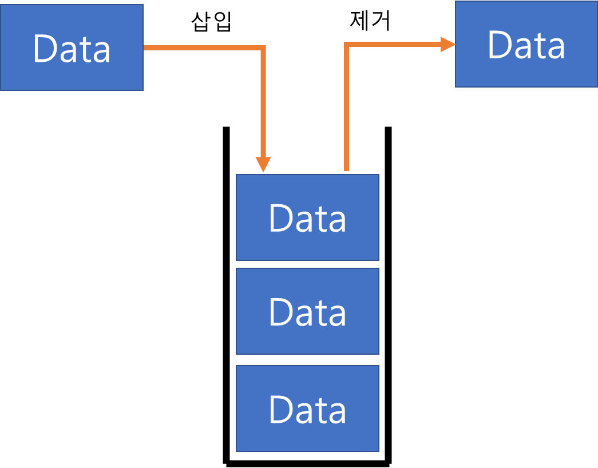
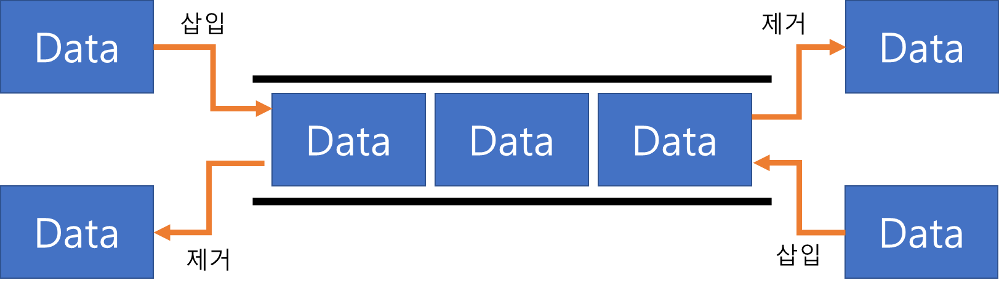
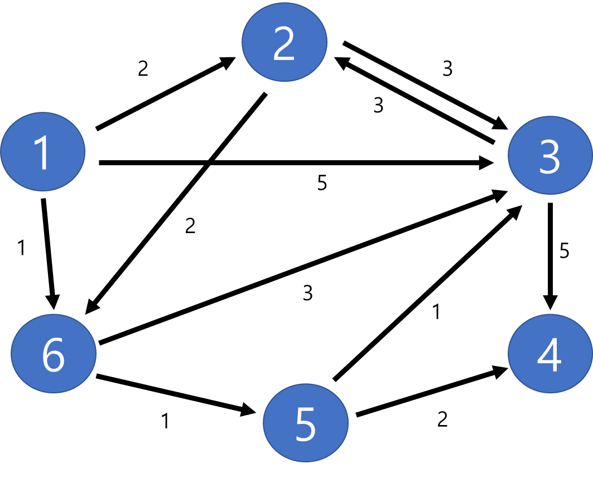
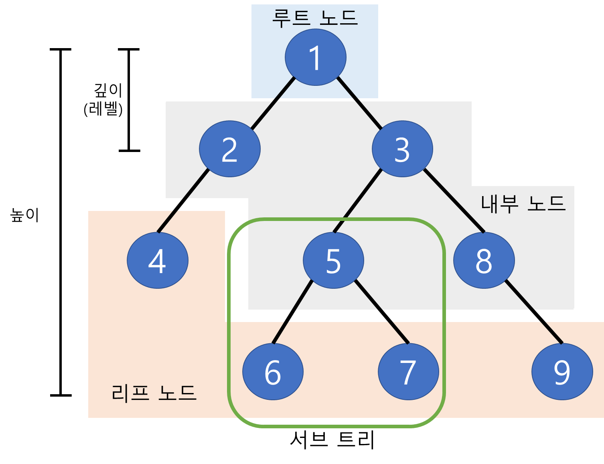

# 선형 자료 구조

### 스택 (Stack)

- 스택 이란 무엇인가?

  - 후입선출 LIFO (Last In First Out)의 성질을 가진 자료 구조
  - 창고에 박스를 하나씩 쌓고 하나씩 빼내는 느낌





- 스택은 어디에 쓰이는가?

  - 데이터가 스트리밍 되고 있는 상황에서 최신의 데이터를 다뤄야하는 경우
  - 윈도우의 `ctrl` + `z`, 웹 브라우저의 뒤로가기
  - 문자열이나 리스트의 `reverse`

  

- 파이썬에서 스택을 쓰려면?

```python
# 리스트만으로도 구현 가능
# 스택 정의
stack = []

# 스택 원소 삽입
stack.append(data)

# 스택 원소 추출
stack.pop()
```


### 큐 (Queue)

- 큐 이란 무엇인가?

  - 선입선출 FIFO (first In First Out) 의 자료 구조


- 큐은 어디에 쓰이는가?

  - 순서 보장이 필요한 데이터 처리
  - CPU의 프로세스 스케줄링, 네트워크, 버퍼 처리

  

- 파이썬에서 큐를 쓰려면?

< 방법1 >

```python
# 큐 정의
queue = []

# 큐 원소 삽입
queue.insert(0,data)

# 큐 원소 추출
queue.pop()
```


< 방법2 >

```python
# 큐 정의
queue = []

# 큐 원소 삽입
queue.append(0,data)

# 큐 원소 추출
queue.pop(0)

## pop(0)은 사용하지 않는 편이 좋음
## 남은 요소를 하나씩 땡겨야 해서 시간 복잡도가 올라감
```


< 방법3 >

```python
## 추천 방법 ##
# 방법1과 로직은 같음
# 덱 모듈 import
from collections import deque

# 큐 정의
queue = deque()

# 큐 원소 삽입
queue.appendleft(data)

# 큐 원소 추출
queue.pop()
```


< 방법4 >

```python
## 추천 방법 ##
# 방법2와 로직은 같음
# 덱 모듈 import
from collections import deque

# 큐 정의
queue = deque()

# 큐 원소 삽입
queue.append(data)

# 큐 원소 추출
queue.popleft()
```


### 덱 (Deque)

- 덱이란 무엇인가?
  - stack과 queue를 합친 구조




- 덱은 어디에 쓰이는가?
  - 스택과 큐를 사용할 수 있는 곳


- 파이썬에서 덱을 쓰려면?
  - 보통 시간 초과가 나오기 쉬운 문제가 많기 때문에 모듈 사용 권장

```python
# 덱 모듈 import
from collections import deque

# 큐 정의
queue = deque()

# 큐 원소 삽입
# 오른쪽 삽입
queue.append(data)
# 왼쪽 삽입
queue.appendleft(data)

# 큐 원소 제거
# 왼쪽 제거
queue.popleft()
# 오른쪽 제거
queue.pop()
```


# 비선형 자료 구조

### 그래프 (Graph)

- 그래프는 무엇인가?

  - 정점(node)과 간선(edge)으로 이루어진 자료 구조 
  - 노드를 정점 (Vertex)이라고도 함

  - 연결되어 있는 객체들을 표현 가능한 자료 구조 (객체를 정점 객체간의 관계를 간선으로 표현)




- 그래프는 어디에 쓰이는가?
  - 최단 경로 알고리즘(다익스트라, 플로이드 워셜)
  - BFS, DFS 알고리즘


- 파이썬에서 그래프를 쓰려면?

  - 인접 행렬을 사용한 표현

  ```python
  # 노드 개수(n)와 간선 개수(m)
  n, m = map(int, input().split())
  
  # 인접 행렬
  graph = [[float('inf')]*(n+1) for _ in range(n+1)]
  
  # 자기 자신과의 거리는 0으로 초기화
  for i in range(n+1):
      graph[i][i] = 0
  
  # 간선 정보
  for _ in range(m):
      # start_node와 end_node를 잇는 간선에 대한 distance 
      # (간선의 distance는 없는 경우도 있음 ex: BFS, DFS)
      start_node, end_node, distance = map(int, input().split())
      graph[start_node][end_node] = distance
      
  '''
  예를 들면 아래와 같이 행렬의 형태로 만들어짐
  [
  	[0, 1, 3],
  	[1, 0, 4],
  	[3, inf, 0]
  ]
  '''
  ```

  

  

  - 인접 리스트를 사용한 표현

  ```python
  # 노드 개수(n)와 간선 개수(m)
  n, m = map(int, input().split())
  
  #노드 맵핑하기 위한 리스트
  graph = [[] for _ in range(n+1)]
  
  # 간선 정보
  for _ in range(m):
      # start_node와 end_node를 잇는 간선에 대한 distance 
      # (간선의 distance는 없는 경우도 있음 ex: BFS, DFS)
      start_node, end_node, distance = map(int, input().split())
      graph[start_node].append((end_node, distance))
      
  '''
  예를 들면 아래와 같이 리스트의 형태로 만들어짐
  [
  	[(1,1), (2,3)],
  	[(0,1), (2,4)],
  	[(0,3)]
  ]
  '''
  ```


### 트리 (Tree)

- 트리이란 무엇인가?
  - 그래프 구조의 일종
  - 그래프와는 다르게 부모 자식 계층으로 구성
    - 경로상 어떤 노드보다 위에 있으면 부모 노드, 아래에 있으면 자식 노드
  - 루트 노드, 내부 노드, 리프 노드로 구성
    - 루트 노드 : 가장 위에 있는 노드, 보통 탐색의 시작점
    - 내부 노드 : 루트 노드와 리프 노드 사이에 있는 노드 
    - 리프 노드 : 자식 노드가 없는 노드
  - 간선 수 = 노드 수 - 1 이라는 특징이 있음
  - 임의의 두 노드 사이의 경로는 유일무이하게 존재
    - 트리 내의 두 노드의 경로는 반드시 있음
    - 트리 내 사이클 구조는 없음


| #                   | 그래프                  | 트리                |
| ------------------- | ----------------------- | ------------------- |
| 방향성              | 방향 또는 무방향 그래프 | 방향 그래프         |
| 순환성              | 순환 및 비순환          | 비순환              |
| 루트 노드 존재 여부 | 없음                    | 있음                |
| 노드간 관계성       | 부모 자식 관계 없음     | 부모 자식 계층 관계 |
| 모델의 종류         | 네트워크 모델           | 계층 모델           |




- 트리은 어디에 쓰이는가?
  - BFS, DFS
  - 힙 구현


- 파이썬에서 트리을 쓰려면?
  - 그래프와 동일


### 힙 (Heap)

- 힙이란 무엇인가?
  - 트리 구조에 기반한 자료 구조
  - 우선 순위 큐를 구현하기 위한 자료 구조
  - 최대힙과 최소힙이 있음
    - 최대힙 : 부모 노드가 자식 노드보다 크며, 루트 노드가 트리 내에서 가장 큰 값을 가짐
    - 최소힙 : 부모 노드가 자식 노드보다 작으며, 루트 노드가 트리 내에서 가장 작은 값을 가짐


- 힙은 어디에 쓰이는가?
  - 최단 거리 알고리즘
  - 우선 순위를 고려한 데이터 정렬


- 파이썬에서 힙을 쓰려면?

```python
# 힙 모듈
# 기본값으로 최소힙으로 되어있음
# 최대힙으로 사용하기 위해서는 데이터에 -1를 곱해서 삽입하면 됨
import heapq

# 힙으로 사용할 리스트 초기화
heap = []

# 힙에 데이터 삽입
heapq.heappush(heap, data)

# 힙에서 가장 작은 데이터 추출
heapq.heappop(heap)

# 새로운 데이터 삽입하고 힙에서 가장 작은 데이터를 추출 
heapq.heappushpop(heap, data)
# 가장 작은 데이터를 추출하고 새로운 데이터 삽입
heapq.heapreplace(heap, data)

# 기존의 리스트를 힙 구조로 변환
x = [1,5,3,4,2,6]
heapq.heapify(x)
```


### 우선 순위 큐 (Priority Queue)

- 우선 순위 큐란 무엇인가?
  - 삽입된 순서에 상관없이 우선 순위가 높은 데이터가 추출 되는 자료 구조
  - 
- 우선 순위 큐은 어디에 쓰이는가?
  - 힙을 이용하여 구현되었기 때문에 힙을 사용하는 곳에 사용 가능
  - 최단 거리 알고리즘
  - 우선 순위를 고려한 데이터 정렬


- 파이썬에서 우선 순위 큐을 쓰려면?
  - PriorityQueue 혹은 heapq를 사용할 수 있음
  - 속도는 heapq가 더 빠름

```python
# PriorityQueue 모듈
from queue import PriorityQueue

# 우선 순위 큐 정의
que = PriorityQueue()
que = PriorityQueue(maxsize = n)  # 최대 크기를 지정 가능

# 데이터 삽입
que.put(data) # 최소힙과 같은 구조
que.put((2, "apple")) # (우선순위, 데이터) 형태로 삽입 가능

# 데이터 추출
que.get()

# 큐 사이즈 반환
que.qsize()

# 큐가 비어있는지 확인하는 함수
que.empty() # 비어있으면 True, 데이터가 있으면 False
```


### 해시 테이블

- 해시 테이블이란 무엇인가?
  - 무한에 가까운 데이터들을 유한한 개수의 해시 값으로 매핑한 데이터 구조
    - 다양한 길이를 가진 데이터들을 고정된 길이의 데이터로 매핑
  - 해시값을 가지고 검색하면 데이터를 빠르게 찾을 수 있음
  - 파이썬에서 딕셔너리형과 같은 구조(key가 해시값, value가 데이터)
  - 해시값 생성을 잘 만들지 않으면 충돌이 일어남


- 해시 테이블은 어디에 쓰이는가?
  - 보안분야, 암호의 디코딩 방지
  - 데이터 READ가 빈번하게 일어나는 경우


- 파이썬에서 해시 테이블을 쓰려면?
  - 파이썬 딕셔너리 사용


# 레퍼런스

- 면접을 위한 CS 전공지식 노트
- 파이썬 알고리즘 인터뷰
- Gyuseok Kim의 블로그 https://gyoogle.dev/blog/
- VSFe의 Hithyb https://github.com/VSFe/Algorithm_Study/blob/main/Concept/Prev/vol.2/01_Data_Structure/Ch.01_%EA%B8%B0%EB%B3%B8_%EC%9E%90%EB%A3%8C%EA%B5%AC%EC%A1%B0.pdf
- 파이썬 heapq모듈의 문서 https://docs.python.org/ko/3/library/heapq.html
- 파이썬 PriorityQueue 모듈의 문서 https://docs.python.org/ko/3/library/asyncio-queue.html