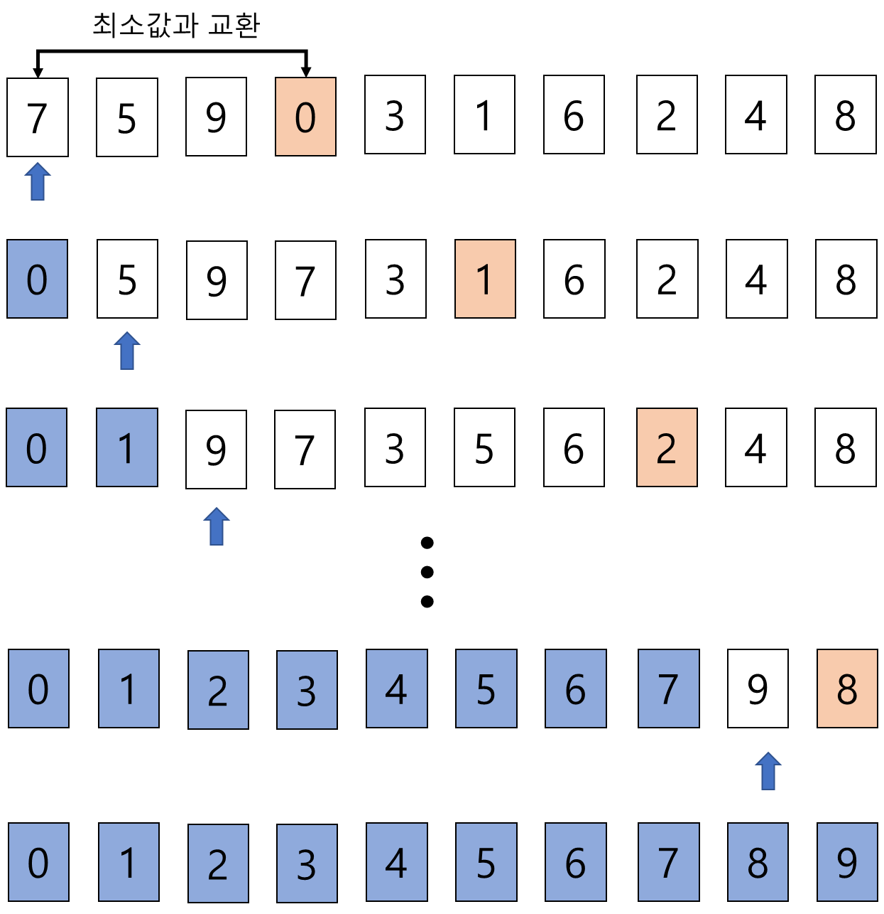
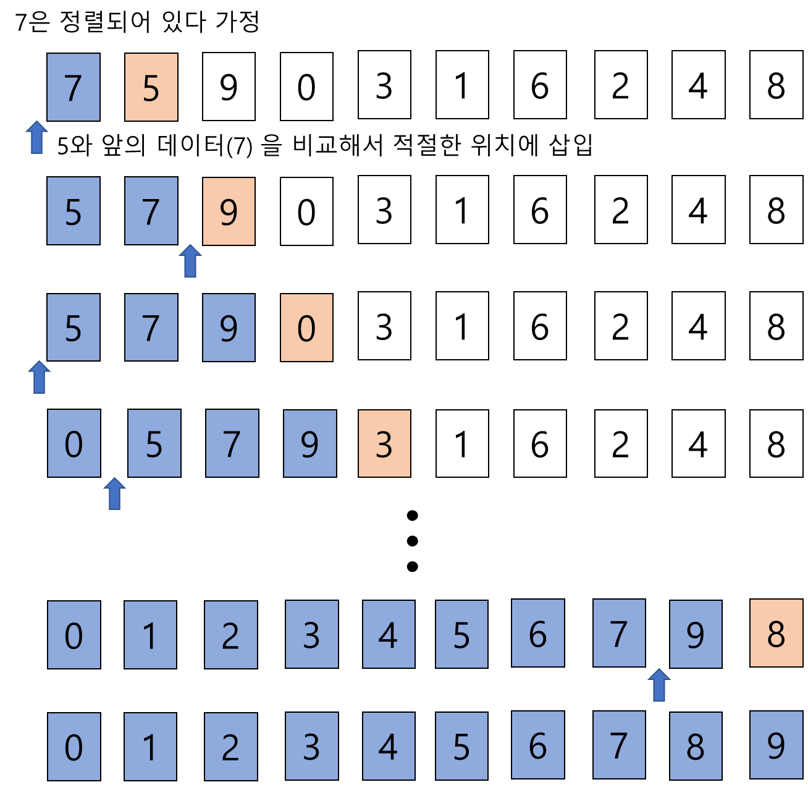
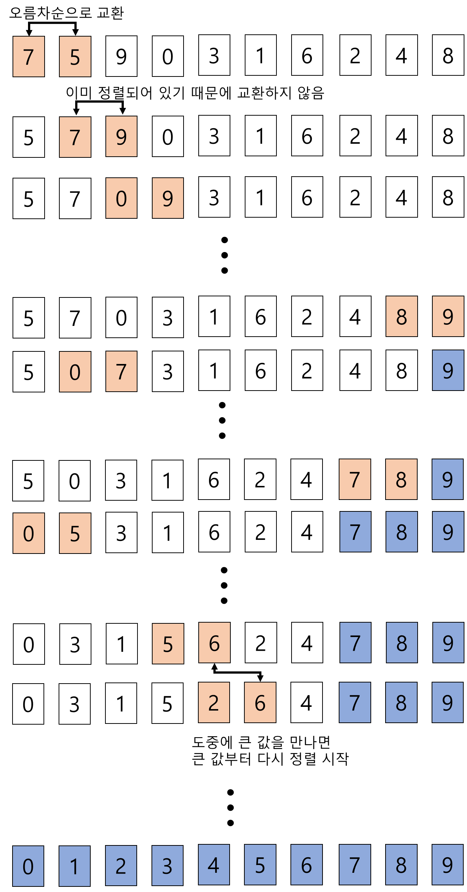
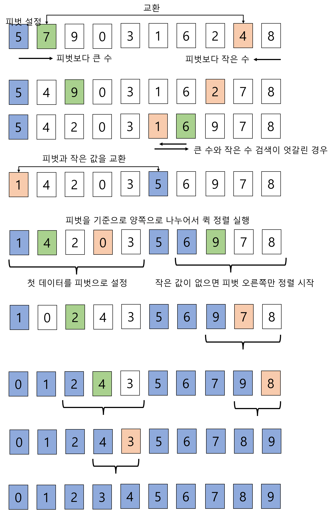
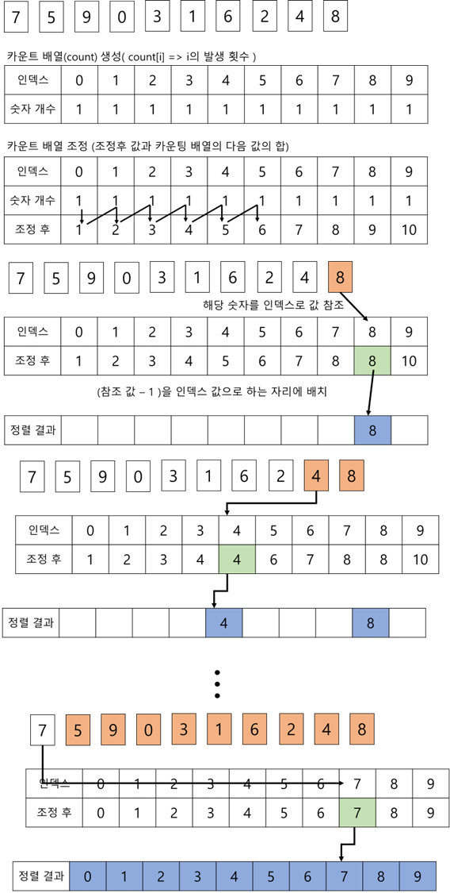

## 선택 정렬

- 선택 정렬이란?
  - 주어진 자료들 중 가장 작은 값의 원소부터 차례대로 선택하여 위치를 교한하는 방식


- 정렬 과정
  1. 주어진 리스트중 최소값을 찾는다
  2. 그 값을 리스트 맨 앞에 위치한 값과 교환
  3. 맨 처음 위치를 제외한 나머지 리스트를 대상으로 위의 과정을 반복



- 파이썬에서 구현

  ```python
  # 오름 차순 정렬
  array = [7, 5, 9, 0 ,3, 1, 6, 2, 4, 8]
  N = len(array)
  
  for i in range(N):
      idx = i
      for j in range(i+1, N):
          if array[idx] > array[j]:
              idx = j
      array[j], array[idx] = array[idx], array[j]
      
  print(array)
  ```

  

- 선택 정렬의 시간 복잡도
  - N개의 데이터를 정렬하는데 (N * (N + 1) ) / 2 번의 연산을 수행
  - 대략 O(N^2)


## 삽입 정렬

- 삽입 정렬이란?
  - 데이터를 하나씩 확인하며 각 데이터를 적절한 위치에 삽입


- 정렬 과정
  1. 첫 데이터는 그 자체로 정렬이 되어있다고 가정
  2. 그 다음 데이터가 그 전 데이터들 사이에서 어디에 들어가야 할지 파악
  3. 해당 자리에 삽입




- 파이썬에서 구현

  ```python
  # 오름 차순
  array = [7, 5, 9, 0 ,3, 1, 6, 2, 4, 8]
  N = len(array)
  
  for i in range(N):
      for j in range(i, 0, -1):
          if array[j] < array[j-1]:
      	    array[j], array[j-1] = array[j-1], array[j]
          else:
              break
  
  print(array)
  ```

  

- 삽입 정렬의 시간 복잡도
  - O(N^2)
  - 정렬 대상 리스트가 어느 정도 정렬된 상태라면 매우 빠름


## 버블 정렬

- 버블 정렬이란?
  - 인접한 두 개의 원소를 비교하며 자리를 계속 교환하는 방식


- 정렬 과정
  1. 첫 번째 원소부터 인접한 원소끼리 계속 자리를 교환하면서 맨 마지막 자리까지 이동
  2. 한 단계가 끝나면 가장 큰 원소가 마지막 자리로 정렬
  3. 인접한 원소가 더 크다면 인접한 원소 부터 다시 버블 정렬 시작




- 파이썬에서 구현

  ```python
  array = [7, 5, 9, 0 ,3, 1, 6, 2, 4, 8]
  N = len(array)
  
  for i in range(N-1, 0, -1):
      for j in range(0, i):
          if array[j] > array[j+1]:
      	    array[j], array[j+1] = array[j+1], array[j]
  
  print(array)
  ```

  

- 버블 정렬의 시간 복잡도
  - O(N^2)


## 퀵 정렬

- 퀵 정렬이란?
  - 기준 데이터를 설정하고 그 기준보다 큰 데이터와 작은 데이터의 위치를 바꾸는 정렬
  - 앞에서 나온 정렬 방법보다 월등히 빠른 정렬 방법


- 정렬 과정
  1. 큰 숫자와 작은 숫자를 교환하기 위한 기준으로 피벗을 설정
     - 리스트 첫 번째 데이터를 피벗으로 설정
  2. 왼쪽에서부터 피벗보다 큰 데이터 검색, 오른쪽에서 피벗보다 작은 데이터 검색
  3. 큰 데이터와 작은 데이터 위치를 교환




- 파이썬에서 구현

  - 코드 1

  ```python
  array = [5, 7, 9, 0 ,3, 1, 6, 2, 4, 8]
  N = len(array)
  
  def quick_sort(array, start, end):
      if start >= end: # 원소 1개인 리스트 예외처리
          return
      
      pivot = start
      left = start + 1
      right = end
      
      while left <= right:
          # 피벗보다 큰 데이터 찾기
          while left <= end and array[left] <= array[pivot]:
              left += 1
          # 피벗보다 작은 데이터 찾기
          while right > start and array[right] >= array[pivot]:
              right -= 1
              
          if left > right: # 엇갈린 경우 피벗 교환
              array[right], array[pivot] = array[pivot], array[right]
          else: # 엇갈리지 않았다면 작은데이터와 큰 데이터 교환
              array[left], array[right] = array[right], array[left]
              
          # 재귀로 왼쪽 분할과 오른쪽 분할 정렬
          quick_sort(array, start, right - 1)
          quick_sort(array, right + 1, end)
              	
  quick_sort(array, 0 , N-1)         
  print(array)
  ```


- 퀵 정렬의 시간 복잡도
  - O(NlogN)


## 카운팅 정렬

- 카운팅 정렬이란
  - 항목들의 순서를 결정하기 위해 집합에 각 항목이 몇 개씩 있는지 세는 작업을 하여, 선형 시간에 정렬하는 알고리즘
  - 효율적인 정렬이지만 제한 사항이 있음
    - 정수나 정수로 표현할 수 있는 자료만 가능
    - 정수내 가장 큰 정수를 알아야함


- 정렬 과정
  1. 데이터에서 각 항목들의 발생 회수를 세고, 정수 항목들로 직접 인덱스 되는 카운트 배열에 저장
  2. 정렬된 집합에서 각 항목의 앞에 위치할 항목의 개수를 반영하기 위해 카운트 배열 조정




- 파이썬에서 구현

  ```python
  array = [7, 5, 9, 0 ,3, 1, 6, 2, 4, 8]
  N = len(array)
  
  # 최대값 파악
  k = max(array)
  
  # 카운팅 배열 생성
  counts = [0] * (k+1)
  for i in range(N):
      counts[array[i]] += 1
  
  # 카운팅 배열 조정
  for j in range(1, k+1):
      counts[j] += counts[j-1]
  
  array_sorted = [0] * N
  for k in range(N-1, -1, -1):
      counts[array[k]] -= 1
      array_sorted[counts[array[k]]] = array[k]
  
  print(array_sorted)
  ```

  

- 카운팅 정렬의 시간복잡도
  - O(N+k)
  - 고속이지만 제한 사항이 좀 많음


## 레퍼런스

- 교재
- 이것이 취업을 위한 코딩 테스트다 with 파이썬
